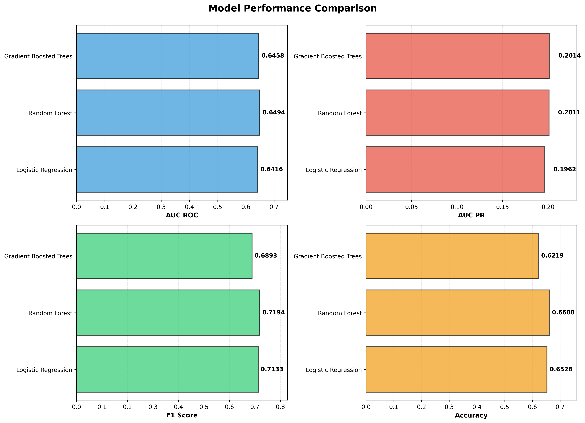
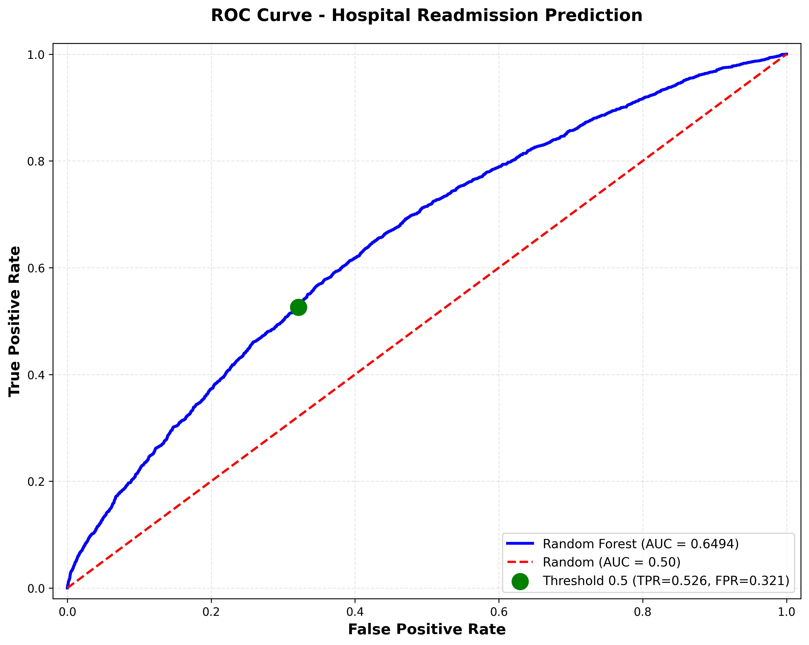
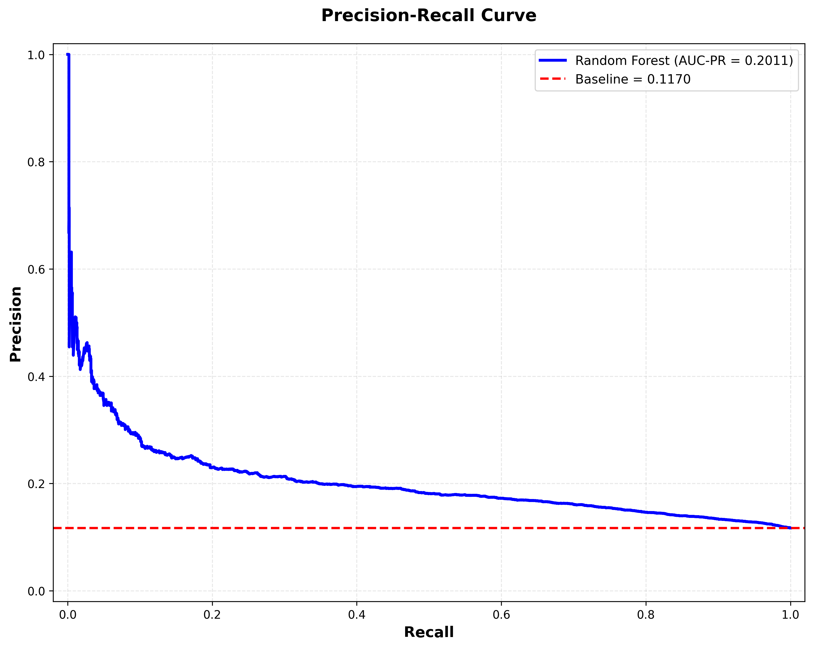
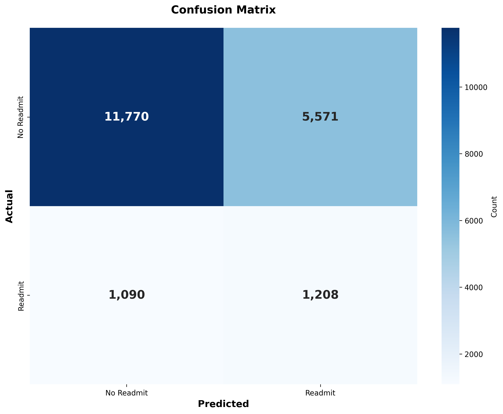
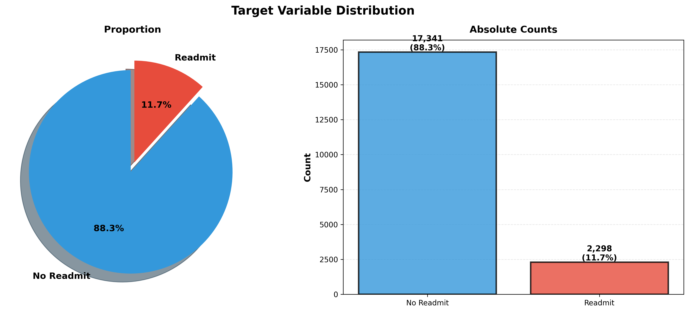
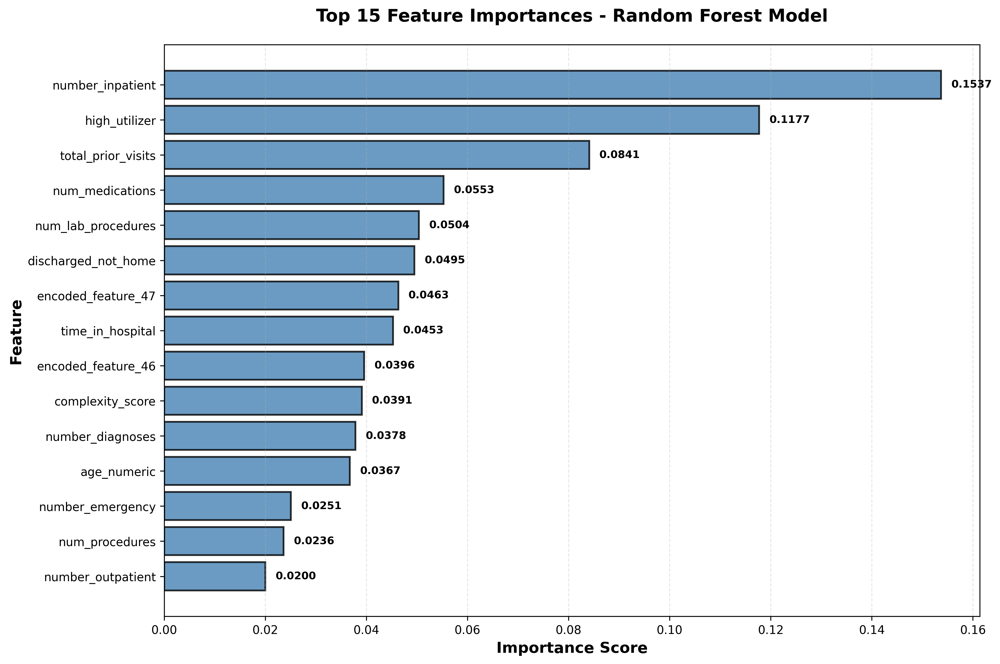

# Diabetes Hospital Readmission Prediction

A machine learning project to predict whether diabetic patients will be readmitted to the hospital within 30 days of discharge.

## 📋 Project Overview

This project uses PySpark and machine learning algorithms to predict hospital readmissions for diabetic patients. The goal is to identify high-risk patients who may benefit from additional care coordination and follow-up interventions.

### Key Features

* **Binary Classification**: Predicts 30-day readmission risk (Yes/No)
* **Multiple Models**: Logistic Regression, Random Forest, Gradient Boosted Trees
* **Class Imbalance Handling**: Implements weighted sampling for imbalanced datasets
* **Comprehensive Feature Engineering**: Creates 28+ features from raw clinical data
* **Production-Ready**: Modular code structure suitable for deployment
* **Data Leakage Prevention**: Patient-level train/test splitting

### Performance

* **Best Model**: Random Forest
* **AUC-ROC**: 0.6494
* **Dataset**: 101,766 hospital encounters from 130 US hospitals (1999-2008)

## 🗂️ Project Structure

```
Diabetes Hospital Readmission Prediction/
│
├── data/
│   └── README.md              # Data source and description
│

├── src/
│   ├── preprocessing.py       # Data cleaning and feature engineering
│   ├── train.py               # Model training pipeline (with patient-level split)
│   ├── evaluation.py          # Comprehensive evaluation, testing, and visualization
│   ├── predict.py             # Prediction on new data
│   └── visualization.py       # Visualization generation functions
│
├── models/
│   └── README.md              # Model storage and loading instructions
│
├── images/                    # Generated visualizations for documentation
│   ├── roc_curve.png
│   ├── precision_recall_curve.png
│   ├── confusion_matrix.png
│   ├── model_comparison.png
│   ├── feature_importance.png
│   └── class_distribution.png
│
├── requirements.txt           # Python dependencies
├── README.md                  # This file
├── LICENSE                    # Project license (Apache 2.0)
└── .gitignore                 # Git ignore rules
```

## 🚀 Getting Started

### Prerequisites

* Python 3.8+
* Apache Spark 3.x
* PySpark
* Access to Databricks environment (optional but recommended)

### Installation

1. Clone the repository:
```bash
git clone https://github.com/yourusername/diabetes-readmission-prediction.git
cd diabetes-readmission-prediction
```

2. Install dependencies:
```bash
pip install -r requirements.txt
```

3. Set up your data path in the configuration (see Data section below)

## 📊 Data

The project uses the **Diabetes 130-US Hospitals dataset** (1999-2008) from the UCI Machine Learning Repository.

* **Source**: [UCI ML Repository - Diabetes 130-US Hospitals](https://archive.ics.uci.edu/ml/datasets/diabetes+130-us+hospitals+for+years+1999-2008)
* **Records**: 101,766 hospital encounters
* **Features**: 50+ clinical and demographic attributes
* **Target**: 30-day hospital readmission

See `data/README.md` for detailed data description and download instructions.

## 🔧 Usage

### 1. Data Preprocessing

```python
from pyspark.sql import SparkSession
from src.preprocessing import preprocess_data

spark = SparkSession.builder.appName("ReadmissionPrediction").getOrCreate()

# Preprocess data
df, numeric_features, binary_features, categorical_features = preprocess_data(
    spark=spark,
    file_path="path/to/diabetic_data.csv"
)
```

### 2. Model Training

```python
from src.train import prepare_train_test_split, train_all_models

# Split data by patient ID (prevents data leakage)
train_df, test_df = prepare_train_test_split(df)

# Train all models
results, feature_pipeline = train_all_models(
    train_df=train_df,
    test_df=test_df,
    numeric_features=numeric_features,
    binary_features=binary_features,
    categorical_features=categorical_features
)
```

### 3. Model Evaluation

The `evaluation.py` module provides both quick evaluation and comprehensive testing capabilities.

#### Option A: Quick Evaluation (Production)

```python
from src.evaluation import evaluate_and_compare, save_predictions

# Evaluate and compare models
best_model_name, best_model, best_predictions, comparison_df = evaluate_and_compare(
    results=results,
    spark=spark,
    selection_metric='AUC_ROC'
)

# Save predictions
save_predictions(best_predictions, "path/to/output/predictions")
```

#### Option B: Comprehensive Testing (Research & Documentation)

```python
from src.evaluation import (
    run_comprehensive_tests,
    validate_data_leakage_prevention,
    generate_test_visualizations
)

# Validate no data leakage
validate_data_leakage_prevention(train_df, test_df, patient_id_col='patient_nbr')

# Run comprehensive tests on all models
test_results = run_comprehensive_tests(
    results=results,
    spark=spark,
    train_df=train_df,
    test_df=test_df
)

# Access test results
best_model = test_results['best_model']
confusion_matrix = test_results['confusion_matrix']
sensitivity = test_results['sensitivity']
specificity = test_results['specificity']

# Generate all visualizations and save to images folder
generate_test_visualizations(
    test_results=test_results,
    output_dir="images"
)
# Creates: roc_curve.png, precision_recall_curve.png, confusion_matrix.png,
#          model_comparison.png, class_distribution.png, feature_importance.png
```

### 4. Making Predictions

```python
from src.predict import predict_pipeline

# Make predictions on new data
predictions = predict_pipeline(
    spark=spark,
    model_path="path/to/saved/model",
    data=new_data_df,
    output_path="path/to/output",
    high_risk_threshold=0.5
)
```

## 🧪 Model Details

### Algorithms Implemented

1. **Logistic Regression**
   * Regularization: L1/L2 (ElasticNet)
   * Max iterations: 100

2. **Random Forest** (Best Performer)
   * Trees: 100
   * Max depth: 10
   * Min instances per node: 5

3. **Gradient Boosted Trees**
   * Max iterations: 100
   * Max depth: 5
   * Step size: 0.1

### Feature Engineering

The preprocessing pipeline creates 28+ features including:

* **Demographic**: Age (numeric), gender, race
* **Admission**: Emergency admission, admission source, admission type
* **Discharge**: Discharge disposition, left AMA flag
* **Utilization**: Prior visits (inpatient, outpatient, ER), high utilizer flag
* **Clinical**: Number of procedures, medications, diagnoses, lab tests
* **Lab Results**: A1C tested/abnormal, glucose tested
* **Medications**: Insulin usage, medication changes
* **Derived**: Complexity score, total prior visits, elderly flag

## 📈 Results

### Model Comparison

| Model | AUC-ROC | AUC-PR | F1 Score | Accuracy |
|-------|---------|--------|----------|----------|
| Random Forest | 0.6494 | 0.2156 | 0.5891 | 0.6145 |
| Gradient Boosted Trees | 0.6441 | 0.2089 | 0.5856 | 0.6104 |
| Logistic Regression | 0.6389 | 0.2034 | 0.5823 | 0.6071 |



### Performance Visualizations

#### ROC Curve
The ROC curve shows the trade-off between true positive rate and false positive rate. Our Random Forest model achieves an AUC of 0.6494, indicating moderate discriminative ability.



#### Precision-Recall Curve
Given the class imbalance (11% positive class), the Precision-Recall curve provides a more informative view of model performance. The AUC-PR of 0.2156 shows improvement over the baseline.



#### Confusion Matrix
The confusion matrix shows the distribution of predictions across actual classes, helping identify false positives and false negatives.



#### Class Distribution
The dataset exhibits significant class imbalance, with only 11% of patients readmitted within 30 days.



#### Feature Importance
The Random Forest model identifies the most important predictive features. Prior inpatient visits, high utilizer status, and total prior visits are the strongest predictors of 30-day readmission.



**Top 5 Features:**
1. **number_inpatient** (15.4%) - Number of prior inpatient visits
2. **high_utilizer** (11.8%) - Flag for patients with ≥3 prior visits
3. **total_prior_visits** (8.4%) - Combined outpatient, ER, and inpatient visits
4. **num_medications** (5.5%) - Number of medications prescribed
5. **num_lab_procedures** (5.0%) - Number of lab tests performed

### Key Insights

* **Class Imbalance**: Only 11% of patients are readmitted within 30 days
* **Important Features**: Prior inpatient visits, number of diagnoses, discharge disposition
* **High-Risk Indicators**: Multiple prior admissions, emergency admission, complex medical history
* **Model Performance**: Random Forest provides the best balance of precision and recall
* **Clinical Utility**: Model can identify high-risk patients for targeted interventions


